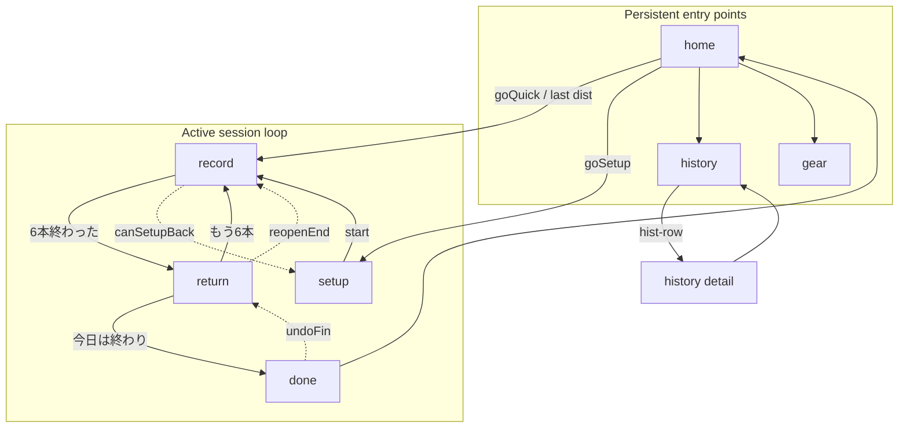
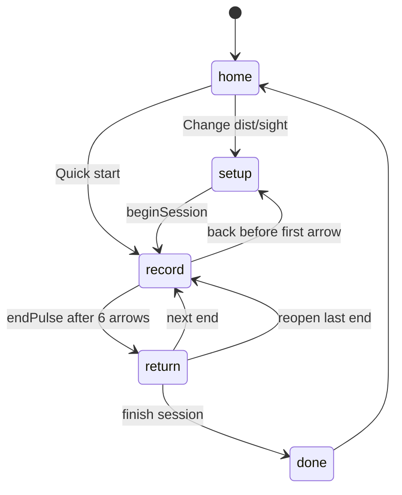

# Archery Converge — Master Design Document

**Version:** Design v1.2 (re-review, baseline app v60)  
**Date:** 2026-06-18  
**Status:** Implementation-ready — follows **Design → Engine → Experience → Exterior**

---

## Executive Summary

Converge is a **judgment-assist** archery practice app: tap six arrow impacts at the target, return to the shooting line, and see grouping plus sight-move **estimates**. The large-scale evolution keeps the **same seven screens** and **vanilla JS** stack while deepening intelligence behind `ConvergeEngine` and `ArcheryPhysics`, enriching verbal results in `ConvergeBeginner`, and polishing motion/tokens in `style.css`.

**North star:** *Simple surface, rich depth* — beauty and comfort that reward repeated use. **Zenkin (全金)** celebration is a permanent brand pillar, never removed or hidden.

**Sibling boundary:** Converge stays **lightweight**. Heavy gear catalogs, deep analytics dashboards, and multi-bow inventory belong in **Archery Note** (separate project), not here.

---

## Goals

| Goal | Success signal |
|------|----------------|
| **Free-first operation** | $0/month hosting, APIs, DB, analytics — GitHub Pages + localStorage only |
| **Thin UI, thick engine** | New smarts land in `engine.js` / `physics.js`; `app.js` calls stable APIs |
| **Progressive depth** | First session: tap → words. 20th session: personal calibration, confidence, wind nuance — same screens |
| **Zenkin as identity** | `Geo.isZenkinEnd`, `flashZenkinConverge`, zenkin faces, coach cards — always visible on achievement |
| **Offline-first PWA** | Full session flow works with no network after first load |
| **Safe judgment assist** | `judgementFor`, `Beg.trustLine`, safety banners — coach/safety always primary |
| **Verifiable increments** | Every PR passes `npm run check`; engine PRs also `npm run check:engine` |

### Free-first policy (hard constraint)

The app **MUST** remain basically free to build and operate:

| Allowed | Forbidden |
|---------|-----------|
| GitHub Pages hosting — https://eita115115.github.io/archery-converge/ | Firebase paid tier, Supabase, Stripe |
| Vanilla JS, no runtime npm deps | Paid SaaS, paid APIs, cloud DB |
| `localStorage` + JSON export/import backup | Third-party auth services |
| Dev-only `sharp` for `npm run icon` | Analytics SDKs that cost money |
| Client-side optional integrations with free tier | CDN paid plans, paid LLM APIs in production |
| Quota exceeded → export nudge + trim guidance (no cloud) | Silent data loss, paid backup services |

**Storage limits:** Browsers cap `localStorage` at roughly **5–10 MB**. Unlimited sessions + `endMeta` arrays risk `QuotaExceededError` on `save()`. Mitigation: `save()` catches quota errors → toast + export nudge (PR **E5**); soft nudge at **150 sessions**, stronger at **200** (§7.3).

Optional future integrations must have a **free tier** or be **fully client-side**.

### Non-Goals

- **React / Vue / build-step migration** — complexity and hosting friction for marginal gain
- **Cloud sync / multi-device real-time** — violates free-first and privacy model
- **WASM physics rewrite** — premature; RK4 in JS is tier-budgeted and bench-validated
- **Archery Note features** — bow inventory, arrow batch tracking, tournament brackets, coach portals
- **Removing or gating zenkin** — non-negotiable
- **Breaking localStorage without migration** — schema changes require versioned migrate blocks
- **Screen sprawl** — no new top-level routes; enhancements are in-place on existing screens
- **Paid LLM coaching** — verbalization stays in `beginner.js` rule tables

---

## Current Architecture (v60)

```
ConvergeApp (app.js — UI, screens, interaction)
  → ConvergeEngine (engine.js — stable API, device tiers low/mid/high)
    → ArcheryPhysics (physics.js — RK4, stats, site advice, calibration caches)
    → ConvergeGeometry (geometry.js — coords, scoring, zenkin faces)
  → ConvergeBeginner (beginner.js — verbalization, coach cards)
  → ConvergeCompat (compat.js — viewport, layout fit)
```

**Load order** (`index.html`): `compat.js` → `geometry.js` → `physics.js` → `engine.js` → `beginner.js` → `app.js`

**Key constants:**
- `KEY = "archeryConverge.v1"` — localStorage root (`app.js`)
- `APP_VER = 60` — UI/cache generation (`app.js`, `sw.js`, `version.json`)
- `RUNTIME_VERSION = 1` — engine API generation (`engine.js`)
- `VERSION = "RK4-3D"` — physics implementation tag (`physics.js`)

### Screens (no new screens planned)

Seven `ui.screen` values — no eighth route. **History detail** is a sub-view: `ui.screen === "history"` with `ui.histId` set → `renderHistDetail()` (not a separate screen enum).

| Screen | `ui.screen` | Primary functions |
|--------|-------------|-------------------|
| Home | `home` | `renderHome`, `startQuickSession`, nav to history/gear |
| Setup | `setup` | `renderSetup`, `beginSession`, wind compass |
| Record | `record` | `renderRecord`, `bindTarget`, zenkin converge |
| Return | `return` | `renderReturn`, `Eng.advice.analyzeEnd`, sight dial |
| Done | `done` | `renderDone`, export backup prompt (`bkOutDone`) |
| History | `history` | `renderHistory`, `renderHistDetail` (sub-view via `ui.histId`) |
| Gear | `gear` | `renderGear`, setup fields, beginner toggle |

**Backup today (v60):** `exportBackup()` is wired on **history** (`bkOutHist`) and **done** (`bkOutDone`). `importBackup()` exists (`app.js:600–619`) but has **no UI button** — planned in PR **X0**.

**Core flow:** 準備 → 記録(6本) → 確認 → 次エンド or 完了

---

## 1. North Star UX Principles

### 1.1 Simple surface

- **One primary action per phase:** Start → Tap ×6 → Return → Next/Finish
- **Beginner mode default ON** (`db.settings.beginnerMode !== false`): words before numbers via `Beg.groupDirection`, `Beg.simpleSightAction`, `returnVerdictHtml`
- **Progressive disclosure:** Technical layer (`adviceTechHtml`, `geoLegendHtml`, `mono` coords) only when beginner mode off
- **No modal maze:** Coach cards (`COACH_CAP = 2` views per phase key) and legends self-dismiss via `coachSeenMap`

### 1.2 Rich depth (earned, not shown upfront)

Depth unlocks through **use**, not settings toggles:

| Depth signal | Engine source | User-facing (Experience) |
|--------------|---------------|--------------------------|
| Grouping confidence | `robustStats().confidence` | `Beg.trustLine` tiering |
| Personal tendency | `personalModel().state` | "過去と一致" / "今回だけ" in trust + judgement |
| Regression clicks | `regressionAdvice`, `personalPhysicsCalibration` | Click suggestions in `adv.moves` |
| Wind drift | `windModel`, `trajectoryModel.windDriftCm` | `judgementFor` → "風考慮" |
| Gear precision | `gearPrecisionProfile` | Settings hint + trust line |

### 1.3 Apple-inspired refinement + playfulness

- **Refinement:** `--sk-*` tokens, `typography-headline`, pill buttons (`--sk-button-border-radius: 980px`), spring easing (`--ease-spring`)
- **Playfulness:** Zenkin pop (`zenkin-pop`), converge rings (`zenkin-converge`), dot converge on progress bar, haptic `tapHaptic({ zenkin })`
- **Comfort:** `frame.fit` viewport lock on record/return, `Cx.layoutFit` square target, reduced-motion media queries in `style.css`

### 1.4 Zenkin brand (immutable)

Zenkin touches **record**, **return**, **pulse overlay**, **coach cards**, **SW cache** (`zenkin/1–4.jpg`):

```javascript
// app.js — must never be removed or feature-flagged off
function flashZenkinConverge(stack, prog) { /* converge-ring + zenkin-dots */ }
endPulse(t, cb, { zenkin: zen });
```

`geometry.js` references `zenkin/` assets; `refs/oppai/` stays gitignored — no legacy tokens in public code.

### 1.5 Lightweight vs Archery Note

| Converge | Archery Note (out of scope) |
|----------|----------------------------|
| One active setup (`db.setups[0]`) | Multi-bow rack |
| Session list + per-session target view | Cross-session analytics dashboards |
| Sight suggestion estimate | Full gear lifecycle, spine charts |
| JSON backup | Cloud sync, team features |

---

## 2. Screen Map & User Flows

### 2.1 Screen relationship (current + planned enhancements)



### 2.2 Session state machine



### 2.3 Planned in-screen enhancements (no new routes)

| Screen | Enhancement | Layer | PR |
|--------|-------------|-------|-----|
| **return** | Session memory chip ("3回連続・上寄り") | Engine + Experience | **X2** |
| **return** | Confidence meter (beginner: `Beg.confidenceWords`; pro: `%`) | Experience | **X2** |
| **record** | Subtle wind reminder if `Eng.wind.classify` → windy | Experience | **X3** |
| **done** | Streak / personal best one-liner | Engine + Experience | **X5** |
| **history** | Import backup button (wire `importBackup`) | Experience | **X0** |
| **history detail** | End-by-end grouping summary (collapsed) | Engine + Experience | **X4** (via `analyzeSession` + `grouping.describe`) |
| **gear** | Calibration quality indicator (`calibrationDigest` / `convergeIndex`) | Engine + Experience | **X6** (UI) + **E5** (data) |
| **home** | Converge readiness chip — qualitative, not raw index (e.g. "あと3回で傾向が見えやすく") | Experience | **X6** |

---

## 3. ConvergeEngine API Roadmap

`engine.js` is the **stable contract**. UI and `beginner.js` must not import `ArcheryPhysics` directly for **new** features — go through `Eng.*`. Existing leaks (`trustCtx` calling `Phy.gearPrecisionProfile`, `Phy.sessionQuality`) are removed in PR **E0** before Engine phase exit (see **K2**, **K3**).

### 3.1 Current API (v1, frozen baseline)

```javascript
ConvergeEngine = {
  runtimeVersion: 1,
  physicsVersion: "RK4-3D",
  profile, deviceProfile(), applyProfile(),
  clearCaches(), invalidateSetup(setupId),
  grouping: { robust, simple },
  ballistics: { profile, wind, simulate, trajectory, trajectoryFor },
  advice: { forEnd, judgement, quality, analyzeEnd },
  calibration: { personal, regression, physics, gear },
  ringW
}
```

**Canonical call sites today:**
- `app.js:125` — `Eng.grouping.robust(ar)`
- `app.js:128` — `Eng.advice.forEnd(...)` (legacy; return uses analyzeEnd)
- `app.js:858` — `Eng.advice.analyzeEnd(...)` — **return screen one-call**

### 3.2 Proposed API additions (Engine phase)

Bump `RUNTIME_VERSION` to **2** when any breaking shape changes; additive fields are non-breaking.

#### 3.2.1 `Eng.metrics` — numeric helpers only (no user-facing copy)

**Ownership split (K3):** `Eng.metrics` returns numbers and enums; **`beginner.js` owns all Japanese/English strings**. `Beg.groupDirection(st, faceD)` becomes a thin wrapper that calls `Eng.metrics.offsetBands(faceD)` and assembles copy locally — single verbalization source, testable via `check:beginner`.

```javascript
Eng.metrics = {
  ringW: Geo.ringW,
  offsetBands(faceD),           // { softDist, strongDist, kSoft, kStrong } — see formula below
  offsetClass(mx, my, faceD),   // "center" | "soft" | "strong" per axis
  isCentered(mx, my, faceD),    // both axes within softDist — shared by groupDirection / plainGroup
  ellipseShape(st),             // { ratio, angleDeg, dominant: "h"|"v"|"round" }
  confidenceBand(conf),         // "high" | "mid" | "low" (enum, not localized)
}
```

**`offsetBands` — normative formula (PR E1):**

`ringW(fd) = fd / 20` (`physics.js:48`, `geometry.js:15`). Legacy `beginner.js` uses **absolute** cm thresholds `0.35` / `0.7` calibrated at **reference face** `faceD = 122` (70 m via `Geo.faceDForDist(70)`).

Ring-relative design: multiply ring width by constants derived from the reference face so **70 m behavior is preserved** while 18 m / 30 m / 50 m scale proportionally to target size.

```javascript
const REF_FACE_D = 122;
const LEGACY_SOFT = 0.35;
const LEGACY_STRONG = 0.7;

function offsetBands(faceD) {
  const rw = ringW(faceD);
  const kSoft = LEGACY_SOFT / ringW(REF_FACE_D);    // ≈ 0.057377
  const kStrong = LEGACY_STRONG / ringW(REF_FACE_D); // ≈ 0.114754
  return {
    kSoft, kStrong,
    softDist: rw * kSoft,    // at 122 → 0.35; at 40 → ≈ 0.115
    strongDist: rw * kStrong // at 122 → 0.70; at 40 → ≈ 0.230
  };
}
```

**Not** `softDist = 0.35 / ringW(faceD)` — that inverts the relationship and is dimensionally wrong.

**Design intent:** Thresholds expressed in **ring units** (multiples of one scoring ring) so the same off-center shot feels equivalent across distances; absolute cm limits shrink on smaller faces (18 m) and grow on larger ones only if faceD differs.

**E1 acceptance criteria:**
- `offsetBands(122).softDist` within **ε = 0.001** of `0.35`
- `offsetBands(122).strongDist` within ε of `0.70`
- `check-app` unit test on reference + `faceD=40` (18 m)
- `check:beginner` golden outputs unchanged at `faceD=122` after X1 migration

#### 3.2.2 `Eng.memory` — session intelligence

Expose `personalModel` and extensions without `app.js` scanning `db.sessions`.

```javascript
Eng.memory = {
  personalState(db, sess, setup, st),  // existing personalModel
  sessionStreak(db, setupId, dist),  // consecutive same-direction ends
  convergeIndex(db, setupId, settings), // 0–100 "how well engine knows you"
  readinessHint(db, setupId, settings), // qualitative home chip inputs — PR E3
}
```

**`readinessHint(db, setupId, settings)` — normative (PR E3, verbalized in X6 via `Beg.readinessLine`):**

Returns structured tiers only — **no user-facing strings** (K3).

```javascript
// → { tier, sessionsNeeded, index } | null
// tier: "new" | "building" | "warming" | "ready" | "mature"
function readinessHint(db, setupId, settings) {
  if (!setupId) return null;
  const index = convergeIndex(db, setupId, settings);
  const n = (db.sessions || []).filter(s => s.setupId === setupId).length;
  const toPersonal = Math.max(0, 3 - n);           // personalModel needs ≥3 sessions context
  const toIndex25 = Math.max(0, Math.ceil((25 - index) / 4)); // ~4 pts per session early
  let tier = "new";
  if (index >= 75) tier = "mature";
  else if (index >= 50) tier = "ready";
  else if (index >= 25) tier = "warming";
  else if (n >= 1) tier = "building";
  return {
    tier,
    index,
    sessionsNeeded: tier === "new" || tier === "building" ? Math.max(toPersonal, toIndex25) : null,
    hasRegression: /* any regressionAdvice quality > 0.5 for setupId */,
  };
}
```

**X6:** `Beg.readinessLine(hint)` maps tier → copy (e.g. `building` + `sessionsNeeded: 3` → "あと3回で傾向が見えやすく"). Home chip calls `Eng.memory.readinessHint` → `Beg.readinessLine` — no inline magic in `app.js`.

**`convergeIndex(db, setupId)` — normative formula (PR E3 golden fixtures):**

| Component | Weight | Cap | Rule |
|-----------|--------|-----|------|
| Session count | `sessions.length × 4` | **40** | Same `setupId`; completed sessions only (`db.sessions`) |
| Personal calibration | `pcal.score × 35` | **35** | `pcal = personalPhysicsCalibration(db, setupId, settings)`; `score` 0–1 |
| Regression quality | `Σ quality × 5` per axis | **25** | Per distinct `dist`: `regressionAdvice`; add `clamp(reg.v.quality,0,1)×5` + same for `h`; sum capped at 25 |

```javascript
function convergeIndex(db, setupId, settings) {
  if (!setupId) return 0;
  const n = (db.sessions || []).filter(s => s.setupId === setupId).length;
  const sessionScore = Math.min(40, n * 4);
  const pcal = personalPhysicsCalibration(db, setupId, settings);
  const calScore = (pcal?.score ?? 0) * 35;
  let regScore = 0;
  const dists = [...new Set((db.sessions || []).filter(s => s.setupId === setupId).map(s => s.dist))];
  dists.forEach(d => {
    const reg = regressionAdvice(db, setupId, d);
    if (reg?.v) regScore += clamp(reg.v.quality ?? reg.v.r2 ?? 0, 0, 1) * 5;
    if (reg?.h) regScore += clamp(reg.h.quality ?? reg.h.r2 ?? 0, 0, 1) * 5;
  });
  regScore = Math.min(25, regScore);
  return Math.round(clamp(sessionScore + calScore + regScore, 0, 100));
}
```

**Visibility:** Index is **internal** for coach milestones (X3 toasts at 25/50/75). Home chip (X6) shows qualitative readiness only — resolves Open Question #9 default.

#### 3.2.3 `Eng.wind` — refined wind layer

```javascript
Eng.wind = {
  model: Phy.windModel,                    // existing
  classify(sess, st),                      // { lateralDominant, driftCm, trustPenalty }
  suggestReconfirm(sess, adv),             // boolean → judgement input
}
```

Moves `isWindy` + lateral scatter check from `judgementFor` into testable `wind.classify`.

#### 3.2.4 `Eng.advice.analyzeSession` — multi-end context

For **done** screen and **history detail** without N× `analyzeEnd` from UI.

```javascript
Eng.advice.analyzeSession(db, settings, setup, session)
// → { ends: [{ st, adv, j }], summary: { trend, totalAdj, bestEnd } }
```

#### 3.2.5 `Eng.grouping.describe` — structured grouping report

```javascript
Eng.grouping.describe(st, faceD)
// → { center: {mx,my}, spread: {rr, sx, sy, angleDeg, major, minor}, outliers: n, method, confidence }
```

Implemented in **PR E4** alongside `analyzeSession`. **X4** history end-rows consume `describe` output + `Beg.groupDirection` — not a dead API.

### 3.3 Device tier policy (unchanged, documented)

`deviceProfile()` in `engine.js` sets:

| Tier | `maxSimSteps` | `trajectoryCacheSize` | `rk4Dt` |
|------|---------------|----------------------|---------|
| low | 2200 | 8 | 0.008 |
| high | 5000 | 24 | 0.006 |
| mid | 3600 | 16 | 0.006 |

**Rule:** New physics features must respect `Phy.configure()` from `applyProfile()` — no unbounded loops.

### 3.4 API versioning rules

1. Additive fields on existing return objects → same `runtimeVersion`
2. Renamed/removed fields → bump `runtimeVersion`, document in `docs/DESIGN.md` changelog
3. `tools/check-app.js` asserts `Eng.advice.analyzeEnd` exists and returns `{ st, adv, j }`
4. `tools/engine-bench.js` — **v60: informational only** (logs timings, always exits 0). **CI0** runs it with `continue-on-error`. **E2** adds first `process.exit(1)` assertions and makes CI step required; **E4** adds `analyzeSession` / `grouping.describe` max-ms gates.

---

## 4. Physics & Calibration Evolution

All growth stays in `physics.js`, exported through `engine.js`.

### 4.1 Grouping (`robustStats`)

**Current:** Ellipse-biweight MAD outlier rejection, `confidence` from `effN`, outlier rate, skew (`physics.js:76–118`).

| Planned item | Owner | Notes |
|--------------|-------|-------|
| Ring-normalized confidence in `judgementFor` | **E3** | Express `rr`, `mx`, `my` in `ringW(faceD)` units |
| In-session drift (ends 1–3 vs 4–6) in `personalModel` | **deferred** | Post-v2; needs session-internal weighting design |

### 4.2 Ballistics (RK4-3D)

**Current:** `simulateArrow`, `solveZeroAngle`, `trajectoryModel` with `trajCache`, air density, Cd heuristics (`physics.js:166–273`).

| Planned item | Owner | Notes |
|--------------|-------|-------|
| Altitude + temperature in trajectory `cacheKey` | **deferred** | Low impact until users fill env fields |
| Gust variability → `adviceModel.confidence` band | **E2** | Uses `windModel.variability`; no UI scare |
| Optional spin drift (`setup.advancedSpin`) | **out of scope** | Flag default off; revisit with Archery Note |

### 4.3 Calibration stack

| Function | Role | Evolution | Owner |
|----------|------|-----------|-------|
| `personalModel` | Compare current end to last 8 same-dist sessions | In-session drift detection | **deferred** (see §4.1) |
| `regressionAdvice` | Sight mark vs impact slope | Min 3 sessions; `quality` → `convergeIndex` | **E3** |
| `personalPhysicsCalibration` | Wind factor + inferred clicks | Persist digest in settings | **E5** |
| `gearPrecisionProfile` | Input completeness score | `missingFieldHints[]` for gear UI | **E5** |

### 4.4 Advice pipeline

**Current chain:** `adviceForEnd` → `adviceModel` → `judgementFor` (`physics.js:462–507`).

| Planned `judgementFor` input | Owner |
|------------------------------|-------|
| `Eng.wind.classify` result | **E2** |
| `Eng.memory.sessionStreak` — lowers "今回だけ" threshold | **E3** |
| Stricter **維持** when `st.rr < ringW×1.2` and `|mx|,|my| < ringW×0.2` | **E3** |

**Non-change:** Advice remains **estimate from grouping** — README disclaimer preserved.

---

## 5. Experience Layer

`beginner.js` owns **all human language**; `app.js` owns layout placement. `Eng.metrics` owns **numbers and enums only** (K3). Call direction: `Beg.*` → `Eng.metrics.*` → never the reverse for copy.

### 5.1 Verbalization map

| Concept | Beginner | Pro (beg off) |
|---------|----------|---------------|
| Group center | `Beg.groupDirection(st, faceD)` → `Eng.metrics.offsetBands` → `returnVerdictHtml` | `mono(st.mx)`, `mono(st.my)` |
| Confidence | `Beg.confidenceWords(band)` from `Eng.metrics.confidenceBand` | `adv.confidence` % in `adviceTechHtml` |
| Spread | `Beg.simpleGroup(st, faceD)` — offset via `Eng.metrics.isCentered` | `R${st.rr}` in `adviceTechHtml` |
| Plain group | `Beg.plainGroup(st, faceD)` — offset via `Eng.metrics.isCentered` | — |
| Sight action | `Beg.simpleSightAction(adv, j)` | `adv.moves` cm + clicks |
| Judgement | `Beg.plainJudgement(j)` (future: expand usage) | `jtagHtml(j)` |
| Trust | `Beg.trustLine(trustCtx)` | `trustLineHtml` technical parts |
| Zenkin | `coachCard` record/return zenkin variants | Same — zenkin is not beginner-only |

### 5.2 Coach progression

**Current:** `COACH_CAP = 2` per `coachKey(phase, ctx)`; zenkin gets distinct keys `record-zenkin`, `return-zenkin`.

**Planned:**
- **Phase 3+ coach:** After `db.sessions.length >= 5`, append one advanced tip to setup coach (wind entry value)
- **Converge index milestones:** At 25/50/75 `convergeIndex`, one-time toast on return — "あなた用の目安が育ってきました"
- **Never cap zenkin coach** below 2 — zenkin cards bypass the `n>0` suppression on record

### 5.3 Return screen composition (target layout)

```
┌─────────────────────────────────────┐
│ returnVerdict (beginner) OR trust   │
├─────────────────┬───────────────────┤
│ target + geo    │ sight dial / adj  │
│ (ret-converge)  │                   │
├─────────────────┴───────────────────┤
│ geo-legend (pro) │ memory chip (new)│
├─────────────────────────────────────┤
│ reopen │ 次へ │ 終了                │
└─────────────────────────────────────┘
```

`ret-converge` CSS class triggers staggered mark/ellipse animations — zenkin uses `celebration` face mode.

### 5.4 Done / history voice

- **done:** `sessCompareHint` → extend with `Eng.memory.sessionStreak` one-liner
- **history detail:** Collapsible end rows: `Beg.groupDirection(st, session.faceD)` per end (X4) — no new screen

---

## 6. Exterior Layer

Deferred polish after Engine + Experience stabilize.

### 6.1 CSS / motion token system

**Existing `--sk-*` (Apple SK reference):** `--sk-body-text-color`, `--sk-button-border-radius`, `--sk-focus-color`, etc. (`style.css:6–9`).

**Planned token families:**

```css
:root {
  /* Motion */
  --sk-duration-fast: .32s;
  --sk-duration-hero: .48s;
  --sk-duration-zenkin: .95s;

  /* Tile system (home-hero pattern) */
  --sk-tile-radius: 20px;
  --sk-tile-padding: 24px;
  --sk-tile-shadow: var(--shadow-lg);

  /* Semantic feedback */
  --sk-tone-ok: var(--hit);
  --sk-tone-hold: var(--sight);
  --sk-tone-warn: var(--beat);
}
```

### 6.2 Tile system

`home-tile`, `tile-headline`, `tile-ctas` (`app.js:553–571`) become reusable for:
- **done** session summary card
- **gear** section cards (bow/arrow, calibration)

No new pages — reuse classes on existing screens.

### 6.3 Motion principles

| Event | Class / keyframe | Reduced motion |
|-------|------------------|----------------|
| Page enter | `#body.page-in` | `animation: none` |
| Arrow hit | `hit-flash`, `mark-pop` | opacity only |
| Zenkin | `zenkin-converge`, `zenkin-dot-in` | static gold ring, no dots |
| Return reveal | `ret-converge` | instant show |

`prefers-reduced-motion` block exists (`style.css:501+`) — extend to new animations.

### 6.4 Deferred exterior backlog

- Home hero subtle parallax on scroll (home only)
- Haptic pattern library tied to judgement tone
- Dark mode — **open question** (see §14)
- PWA install prompt customization in `manifest.json`

---

## 7. Data Model

**Storage key:** `archeryConverge.v1` — bump key only if incompatible; prefer migrate blocks.

### 7.1 Current schema (abbreviated)

```typescript
interface Db {
  setups: Setup[];           // effectively [0] used
  sightMarks: SightMark[];
  sessions: Session[];
  active: ActiveSession | null;
  settings: {
    eyeSight: number;        // default 850
    beginnerMode: boolean;   // default true
    coachSeen: Record<string, number>;
    hasExported?: boolean;
    lastDoneBackupSkip?: string;
    quickGuideSeen?: boolean;
  };
}

interface ActiveSession {
  id, date, dist, faceD, setupId, perEnd: 6,
  sightStart, sightNow, windDir, windSpeed,
  phase: "record" | "return",
  ends: Arrow[][],
  cur: Arrow[],
  endsZenkinFaces: (number|null)[],
  zenkinFaceIdx?: number | null,
  adjLog: AdjEntry[],
  note?: string;
}
```

### 7.2 Minimal extensions ("use more → get smarter")

| Field | Location | Purpose | Size guard |
|-------|----------|---------|------------|
| `settings.calibrationDigest` | settings | `{ setupId, score, clickV70, clickH70, updatedAt }` — cache for gear UI | ~200 B |
| `settings.convergeIndex` | settings | Last computed index | 4 B |
| `settings.engineRuntimeSeen` | settings | Migration / what's-new flag | 4 B |
| `session.endMeta[]` | session (optional) | `{ confidence, jLabel }` per end — avoid recompute in history | ~30 B/end |

**No:** Full trajectory cache in localStorage, per-arrow physics logs, analytics events.

### 7.3 Session retention policy

**Default (decided for implementation):** No hard delete — sessions accumulate until user deletes or imports a smaller backup.

**Soft nudges (E5 + X5):**
- **≥150 sessions:** one-time toast on `done` — "記録が増えています。バックアップを"
- **≥200 sessions:** repeat nudge on home/history backup bars
- **`QuotaExceededError` on `save()`:** catch in `save()`, toast export immediately, do not silently drop data

Hard cap with auto-prune is **out of scope**. Nudge threshold tuning only — see **Open Question #2** (resolved default: 150/200).

### 7.4 Backup format

`exportBackup()` dumps full `db` JSON (`app.js:589`). Import merges via `Object.assign(blankDb(), parsed)` in `importBackup()` — **function exists, UI not wired until X0**.

**Planned (PR X0):** Add `"exportVersion": 1` top-level field on `exportBackup()`; `importBackup()` ignores unknown keys. Import + export buttons on **history** screen. `check-app` asserts export blob includes `exportVersion`.

---

## 8. PWA & Offline Strategy

### 8.1 Service worker (`sw.js`)

**Strategy:** Network-first with cache fallback (navigate → `index.html`).

```javascript
const CACHE = "archery-converge-v{v}";  // tied to APP_VER
const ASSETS = [ /* all JS, CSS, manifest, icons, zenkin/*.jpg, version.json */ ];
```

### 8.2 Growth rules

| Change type | Action |
|-------------|--------|
| New static JS/CSS file | Add to `ASSETS`, bump `APP_VER`, `CACHE` |
| New image font | Add to `ASSETS` if < 500 KB total added |
| Lazy route | **Not used** — all screens in `app.js` |
| version check | `#updBar` compares fetched `version.json` vs `APP_VER` |

### 8.3 Cache size budget

Target **< 2 MB** cached (currently ~10 files + 4 zenkin JPGs). If assets grow:
1. Split optional assets behind second cache — still no CDN cost
2. Compress zenkin JPGs at dev time (`sharp` in `tools/`)

### 8.4 Offline behavior matrix

| Feature | Offline |
|---------|---------|
| Record / return / done | ✅ |
| History / gear | ✅ |
| Export backup | ✅ (history, done — download) |
| Import backup | ⚠️ **code only** — `importBackup()` unwired until **X0**; then ✅ offline |
| version.json update notice | ❌ until online |
| GitHub Pages deploy | N/A (dev) |

---

## 9. Free Infrastructure

| Item | Provider | Cost |
|------|----------|------|
| Static hosting | GitHub Pages | **$0** |
| Domain | `*.github.io` default | **$0** |
| Database | localStorage | **$0** |
| Auth | None | **$0** |
| Analytics | None (optional: privacy-friendly self-count later — client only) | **$0** |
| CI | GitHub Actions free tier — **planned PR CI0** (not in repo today) | **$0** |
| Icons | `sharp` devDependency | **$0** at runtime |
| SSL | GitHub | **$0** |
| **Total monthly** | | **$0** |

---

## 10. Migration Strategy

### 10.1 MIGRATE-V44 removal

```javascript
/* app.js:69-82 — REMOVE-AT: v70 (~2026-Q3) [authoritative] */
function migrateV44Session(a) {
  // endsOppai → endsZenkinFaces, oppaiIdx → zenkinFaceIdx
}
```

**Timeline (authoritative):** Code comment currently says `v55` (`app.js:69`) and `check-app.js` asserts `"REMOVE-AT: v55"` — **misaligned with APP_VER 60**. **PR D1.1** updates comment + `check-app` assertion to **`REMOVE-AT: v70`** before any removal work.

| Milestone | Action |
|-----------|--------|
| **D1.1** | Align `app.js` comment and `check-app.js` string to `REMOVE-AT: v70` |
| **v65** | Dev-only console warning if legacy `endsOppai` / `oppaiIdx` detected post-migrate |
| **v70 (≥2026-Q3)** | **E6:** Delete `migrateV44Session` block; remove `normalizeActive` call |
| **Pre-E6** | `tools/fixtures/v44-active.json` + `check-app` proves migration still works until E6 |

### 10.2 Engine version bumps

| Event | Bump |
|-------|------|
| `Eng.memory` added | `RUNTIME_VERSION = 2` |
| `settings.calibrationDigest` added | `APP_VER` + migrate noop |
| `exportVersion` on backup | **X0** (+ `APP_VER` bump in attached V*) |

### 10.3 localStorage migration pattern

```javascript
function migrateDb(d) {
  const ver = d.schemaVersion || 1;
  if (ver < 2) { /* apply */ d.schemaVersion = 2; }
  return d;
}
```

Call from `load()` before `normalizeActive`. Never rename `KEY` without import path.

**E5 acceptance (normative):** `blankDb()` includes `schemaVersion: 1`. `migrateDb()` bumps v1→v2 when adding `calibrationDigest`. `check-app` loads `tools/fixtures/legacy-v1.json` and asserts post-migrate `schemaVersion === 2`. Current `load()` (`app.js:102–114`) has no `migrateDb` today — E5 adds it.

### 10.4 Service worker migration

Every `APP_VER` bump:
1. `app.js` — `APP_VER`
2. `sw.js` — `CACHE = "archery-converge-v{N}"`
3. `version.json` — `{ "v": N }`
4. `tools/check-app.js` — version assertions

---

## 11. Testing & Benchmark Strategy

### 11.1 `npm run check` (gate)

| Script | Validates |
|--------|-----------|
| `check:app` | Syntax, HTML/CSS contracts, `Eng`/`Phy`/`Geo`/`Beg` presence, zenkin CSS, ringW parity |
| `check:beginner` | `beginner-sim.js` — coach/groupDirection outputs stable |

### 11.2 `npm run check:engine`

**v60 behavior:** `engine-bench.js` logs timings only; **always exits 0** — informational smoke test, not a regression gate (unlike `check-app.js` which fails on contract violations).

Logged baselines today:
- `trajectory cold x20`
- `trajectory cached x200`
- `analyzeEnd x50`

**Enforcement added by PR:**
| PR | Assertion |
|----|-----------|
| **E2** | `wind.classify x200` — fail if > 0.5 ms/call avg |
| **E4** | `analyzeSession` 6 ends — fail if > 50 ms total; `grouping.describe x100` — fail if > 0.2 ms/call |
| **E3** | `convergeIndex x100` — fail if > 5 ms/call (after caches warm) |

**CI0** runs `npm run check` + `npm run check:engine` on every PR. Until **E2**, `check:engine` step uses `continue-on-error: true` (informational). **E2** updates `.github/workflows/check.yml` to make `check:engine` a **required** failing step once bench assertions land.

### 11.3 Fixture expansion

| Fixture | File | Purpose |
|---------|------|---------|
| Zenkin end | `tools/fixtures/zenkin-end.json` | 6× gold arrows |
| Windy lateral | `tools/fixtures/windy-session.json` | judgement 風考慮 |
| v44 legacy | `tools/fixtures/v44-active.json` | migration |
| Sparse gear | `tools/fixtures/minimal-setup.json` | trust line tier |

### 11.4 Manual QA checklist (per release)

- [ ] Record 6, return, adjust sight, next end, finish
- [ ] Zenkin: pulse, converge animation, celebration face
- [ ] Airplane mode full session
- [ ] Export → clear storage → import (requires **X0** shipped)
- [ ] `undoFin`, `reopenEnd`
- [ ] Beginner off: legends, tech bar, confidence

---

## 12. Alternatives Considered

### 12.1 React migration — **Rejected**

| Pros | Cons |
|------|------|
| Component reuse, ecosystem | Build step, bundle size, GH Pages config |
| | Rewrites all of `app.js` — high regression risk |
| | Violates "vanilla JS" free-first simplicity |

**Rationale:** `render()` + `shell()` pattern works; target is richer **engine**, not UI framework.

### 12.2 Cloud sync (Firebase / Supabase) — **Rejected**

| Pros | Cons |
|------|------|
| Multi-device | Paid tiers, auth complexity, privacy |
| | Conflicts with "記録はこの端末のみ" brand |
| | JSON export already solves backup |

**Rationale:** Export/import is the free, honest model. Archery Note may sync later; Converge won't.

### 12.3 WASM physics — **Rejected**

| Pros | Cons |
|------|------|
| Faster RK4 | WASM load binary, MIME on GH Pages, fallback |
| | Current bench: cached trajectory acceptable |
| | `deviceProfile` already tier-limits steps |

**Rationale:** Optimize JS caches + `analyzeEnd` batching first. Revisit only if `check:engine` fails on low-tier budget.

### 12.4 Paid LLM verbalization — **Rejected**

Rule-based `beginner.js` is deterministic, offline, testable (`beginner-sim`). LLM adds cost, latency, safety review.

### 12.5 IndexedDB for session storage — **Rejected**

| Pros | Cons |
|------|------|
| Larger quota (~50 MB+) | Async API complicates synchronous `render()` / `save()` flow |
| Structured queries | Migration from `localStorage` KEY; dual-storage complexity |

**Rationale:** JSON export + soft nudges handle growth within free-first constraints. Revisit only if quota errors persist after user education.

### 12.6 Workbox / build-step Service Worker — **Rejected**

| Pros | Cons |
|------|------|
| Precaching recipes, runtime caching strategies | Implies bundler or build pipeline |
| | Conflicts with hand-maintained `sw.js` + `ASSETS` list |

**Rationale:** Manual `sw.js` (`CACHE`, `ASSETS`, network-first) is ~47 lines and GH Pages-friendly. Growth rules in §8.2 stay explicit.

---

## 13. Implementation Phases

```
Design (this doc) → Engine → Experience → Exterior
```

| Phase | Duration estimate | Deliverable |
|-------|-------------------|-------------|
| Design | ✅ | `docs/DESIGN.md` |
| Engine | 7 PRs (E0–E6) | Facade cleanup, `Eng.metrics`, `Eng.memory`, `Eng.wind`, schema digest |
| Experience | 7 PRs (X0–X6) | Import UI, return verdict, history rows, home/gear chips |
| Exterior | 2–3 PRs | Token expansion, tile cards, motion pass |

---

## Key Decisions

| # | Decision | Rationale |
|---|----------|-----------|
| K1 | **Keep 7 screens** — enhance in place | Avoid sprawl; flow is proven |
| K2 | **ConvergeEngine as sole physics facade** | No new direct `Phy` in `app.js`; **E0** removes `trustCtx` leaks; exit criterion for Engine phase |
| K3 | **`Eng.metrics` numeric only; `beginner.js` owns copy** | `Beg` wraps `Eng.metrics.offsetBands`; `readinessHint` tiers verbalized in `Beg` |
| K4 | **Beginner mode default ON** | Product vision: simple surface; pro layer is opt-out |
| K5 | **Zenkin never gated** | Brand + delight; coach, animation, assets always on |
| K6 | **localStorage + JSON backup only** | Free-first, privacy, GH Pages; quota errors → export nudge (E5) |
| K7 | **Ring-relative thresholds** | `kSoft = 0.35/ringW(122)` preserves 70 m parity; scales by faceD |
| K8 | **Network-first SW** | Fresh deploys reach users; offline fallback to cache |
| K9 | **MIGRATE-V44 delete at v70** | Legacy oppai field names aged out post-Q3 2026 |
| K10 | **No Archery Note scope creep** | Single setup, session-level history sufficient |
| K11 | **Implementation order: Design→Engine→Experience→Exterior** | Depth before polish; avoids re-skinning moving targets |

---

## PR Plan

**21 numbered PRs** (D1, D1.1, CI0, E0–E6, X0–X6, O1–O4) + optional **V\*** version bump per release.

Ordered incremental PRs for a vanilla JS project. Each PR should pass `npm run check` locally; **CI0** enforces on GitHub. Engine PRs run `npm run check:engine` (informational until E2 assertions land).

### Phase 0 — Design & CI

| PR | Title | Files | Deps | Description |
|----|-------|-------|------|-------------|
| D1 | `docs: add master DESIGN.md` | `docs/DESIGN.md` | — | Master design (this document) |
| D1.1 | `docs: align MIGRATE-V44 timeline to v70` | `docs/DESIGN.md`, `app.js` (comment), `tools/check-app.js` | D1 | Change `REMOVE-AT: v55` → `v70` in code + assertion |
| CI0 | `ci: github actions check + engine smoke` | `.github/workflows/check.yml` | D1 | Runs `npm run check` + `npm run check:engine` (`continue-on-error` until E2 removes it) |

### Phase 1 — Engine

| PR | Title | Files | Deps | Description |
|----|-------|-------|------|-------------|
| E0 | `engine: route trustCtx through Eng.*` | `app.js`, `engine.js` | CI0 | Replace `Phy.gearPrecisionProfile` / `Phy.sessionQuality` in `trustCtx` with `Eng.calibration.gear` / `Eng.advice.quality` |
| E1 | `engine: add Eng.metrics numeric helpers` | `engine.js`, `tools/check-app.js` | D1 | `offsetBands` (normative kSoft/kStrong), `isCentered`, `offsetClass`, `ellipseShape`, `confidenceBand`; parity test at faceD=122 |
| E2 | `engine: add Eng.wind.classify` | `engine.js`, `physics.js`, `tools/engine-bench.js`, `.github/workflows/check.yml` | D1 | Extract wind logic; gust→confidence (**§4.2**); **first bench assertions**; CI `check:engine` required |
| E3 | `engine: add Eng.memory + convergeIndex + readinessHint` | `engine.js`, `physics.js`, `tools/fixtures/*`, `tools/engine-bench.js` | D1 | `personalState`, `sessionStreak`, `convergeIndex`, `readinessHint`; judgement streak + 維持 (**§4.4**); ring-normalized confidence (**§4.1**); `RUNTIME_VERSION=2` |
| E4 | `engine: analyzeSession + grouping.describe` | `engine.js`, `physics.js`, `tools/engine-bench.js` | E3 | Multi-end analysis; `Eng.grouping.describe`; bench gates |
| E5 | `engine: migrateDb + calibrationDigest + gear hints + quota` | `app.js`, `physics.js`, `engine.js`, `tools/check-app.js`, `tools/fixtures/legacy-v1.json` | E3 | `migrateDb`, `schemaVersion: 2`, `gearPrecisionProfile.missingFieldHints` (**§4.3**), `save()` QuotaExceeded catch, nudge hooks |
| E6 | `chore: remove MIGRATE-V44 at v70` | `app.js`, `tools/check-app.js` | D1.1, v70 | Delete lines 69–82; update fixtures — **≥2026-Q3 only** |

### Phase 2 — Experience

| PR | Title | Files | Deps | Description |
|----|-------|-------|------|-------------|
| X0 | `experience: backup import/export + exportVersion` | `app.js`, `style.css`, `tools/check-app.js` | CI0 | Import/export on history; `exportVersion: 1`; manual QA import path |
| X1 | `experience: migrate all Beg offset thresholds` | `beginner.js`, `app.js`, `tools/beginner-sim.js` | E1 | `groupDirection`, `simpleGroup`, `plainGroup` use `Eng.metrics.offsetBands` / `isCentered`; `check:beginner` goldens per function |
| X2 | `experience: return memory chip + confidence meter` | `app.js`, `beginner.js`, `style.css` | E3 | Memory chip + `Beg.confidenceWords` / pro % — §2.3 return rows |
| X3 | `experience: coach milestones + record wind hint` | `beginner.js`, `app.js`, `style.css` | E2, E3 | Converge toasts 25/50/75; setup tip; record wind banner when `Eng.wind.classify` |
| X4 | `experience: history end summaries` | `app.js`, `beginner.js` | E4 | Collapsible per-end rows via `analyzeSession` + `grouping.describe` |
| X5 | `experience: done streak + session nudge` | `app.js`, `beginner.js` | E3, E5 | Streak line; 150-session backup nudge |
| X6 | `experience: home readiness + gear calibration UI` | `app.js`, `beginner.js`, `style.css` | E3, E5 | `Beg.readinessLine(Eng.memory.readinessHint(...))`; gear bar uses `missingFieldHints` + digest |

### Phase 3 — Exterior

| PR | Title | Files | Deps | Description |
|----|-------|-------|------|-------------|
| O1 | `exterior: expand --sk-* motion tokens` | `style.css` | X1 | Token families §6.1; refactor hardcoded durations |
| O2 | `exterior: tile cards on done + gear` | `style.css`, `app.js` | O1 | Reuse `home-tile` patterns |
| O3 | `exterior: reduced-motion pass for new anims` | `style.css` | O1 | `ret-converge`, memory chip |
| O4 | `exterior: manifest + icon polish` | `manifest.json`, `tools/render-icon.js`, `icon.svg` | — | `npm run icon`; no runtime cost |

### Version bump PR (attach to each release)

| PR | Title | Files |
|----|-------|-------|
| V* | `chore: bump v{N}` | `app.js` (`APP_VER`), `sw.js`, `version.json`, `check-app.js` |

---

## Open Questions

1. **Tagline revert:** Home uses "着弾が、収束する。" / "6本のあとに、次が見える。" — should subhead revert to an earlier tagline, or A/B between Japanese variants only?

2. **Nudge threshold tuning:** §7.3 sets 150/200 session soft nudges and no hard delete. Tune thresholds (e.g. 100/150) or nudge copy?

3. **`endMeta` persistence:** Store per-end `{ confidence, jLabel }` on session save, or always recompute via `analyzeSession` on history view?

4. **Dark mode:** Worth the token duplication for `--sk-*` dark variants, or stay light-only for archery range glare?

5. **Advanced mode toggle:** Separate from beginner (show confidence %, ellipse angle) or keep single beginner off = pro?

6. **Wind speed granularity:** Stay 0/2/4/6 m/s chips or allow custom entry without UI clutter?

7. **Zenkin asset pipeline:** Ship compressed public zenkin in repo vs keep full-res local-only — affects SW cache size.

8. **English copy parity:** `beg off` English strings are thinner than Japanese — full i18n object or JA-first indefinitely?

9. ~~**`convergeIndex` visibility**~~ **Resolved:** Internal for milestones (X3); home shows qualitative readiness only (X6). Raw 0–100 not shown unless Open Question reopens for pro mode.

10. **Archery Note link:** Subtle footer link to sibling app when it exists — in scope for Converge home footer?

---

## Appendix A — File Reference

| File | Lines of responsibility |
|------|-------------------------|
| `app.js` | `render*`, `db` CRUD, `Eng.advice.analyzeEnd` call site |
| `engine.js` | `analyzeEnd`, `deviceProfile`, API freeze |
| `physics.js` | `robustStats`, `adviceForEnd`, `judgementFor`, `personalModel` |
| `geometry.js` | `isZenkinEnd`, `targetSvg`, `geoSvg`, zenkin faces |
| `beginner.js` | `groupDirection`, `coachCard`, `trustLine` |
| `style.css` | `--sk-*`, zenkin animations, tile typography |
| `sw.js` | `CACHE`, `ASSETS` |
| `tools/check-app.js` | CI gate |
| `tools/engine-bench.js` | Latency smoke test (assertions from E2+) |
| `tools/beginner-sim.js` | Copy regression gate |

## Appendix B — Verification Commands

```bash
npm run check          # check:app + check:beginner
npm run check:engine   # trajectory + analyzeEnd bench
npm run icon           # sharp dev-time icon render
```

---

*End of DESIGN.md*